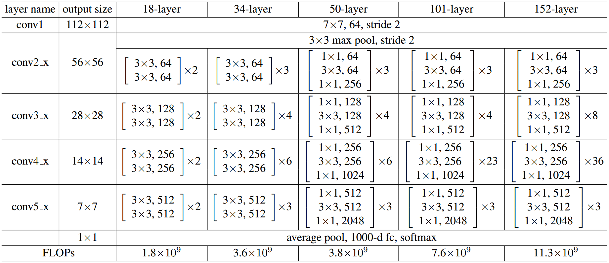
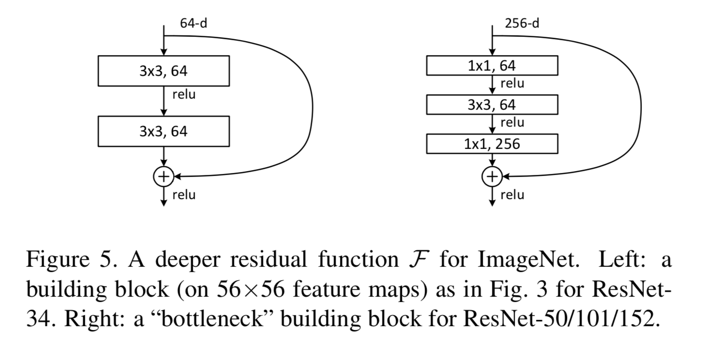
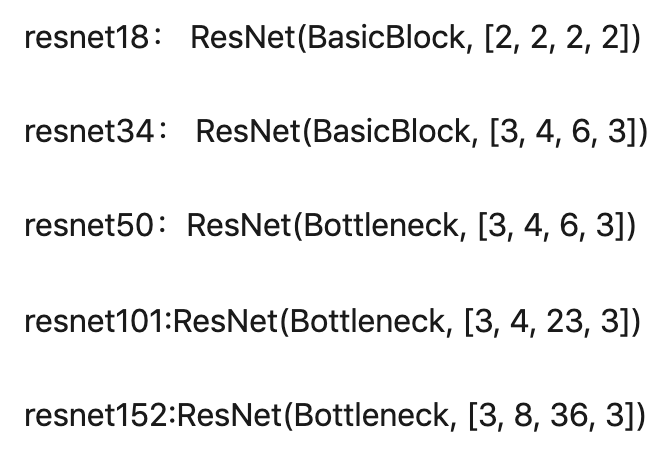
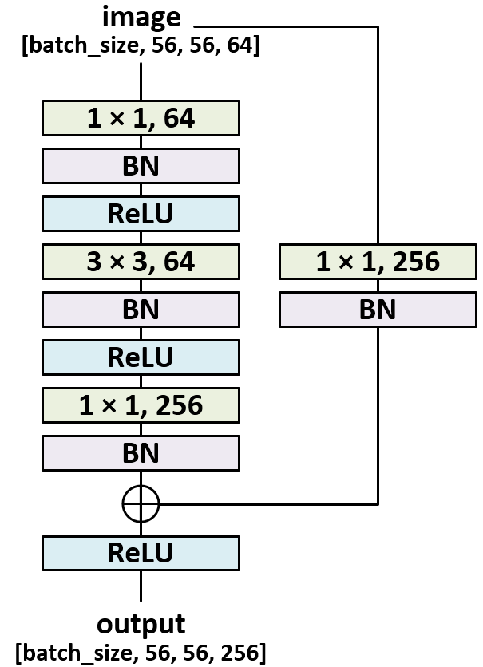
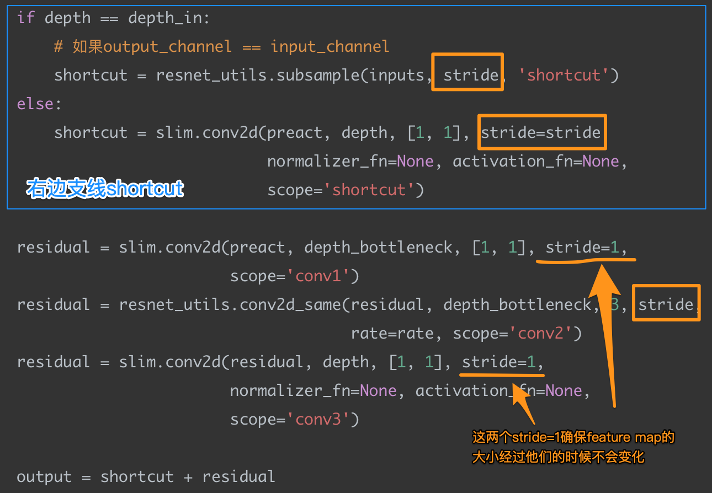
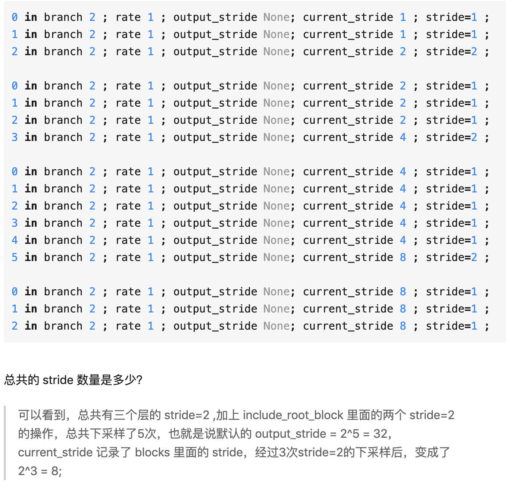

# ResNet_source_code for Tensorflow
source code notes for ResNet

reference:

- (Tensorflow) https://zhuanlan.zhihu.com/p/39316040
- (Tensorflow) https://www.jianshu.com/p/e502e4b43e6d
- (Pytorch) https://blog.csdn.net/a940902940902/article/details/83858694
- (Pytorch) https://zhuanlan.zhihu.com/p/77899090

<p align="center">
    
  	<p align="center">
    	<em style="color:orange; border-bottom: 1px solid #d9d9d9;    display: inline-block;    color: #999;    padding: 2px;"><span id = "img1">各种深度的ResNet</span></em>
</p>


## Table of Contents

* [resnet_v2](#resnet_v2)
* [bottleneck](#bottleneck)
* [resent_v2_block](#resnet_v2_block)
* [resnet_v2_50](#resnet_v2_50)


## resnet_v2

### 函数介绍

可以认为是resnet构造器。resnet_v2_*()函数利用该构造器构造不同深度的resnet。

- 在 imagenet 上训练分类网络通常使用[224, 224] 的输入，经过$2^5=32$的下采样（即$output_stride=32$）后，得到$ 7*7 $的特征图；

- 如果是预测密集像素点的分类（如语意分割），那么建议使用$ (32 * n + 1) $的输入尺寸（如$ 321 * 321$），得到$ [(height - 1) / output_stride + 1, (width - 1) / output_stride + 1]$ 的输出。

  - 得到的特征图严格对齐输入的图片，如输入$ 225 * 225$ 得到$ 8 * 8 $的特征图。

  - resnet 需要使用全卷积模式，并且不使用全局池化，建议使用$ output_stride=16 $来增加输出特征图密度而不过分增加计算量和内存使用

### 参数

```python
def resnet_v2(inputs,
              blocks,
              num_classes=None,
              is_training=True,
              global_pool=True,
              output_stride=None,
              include_root_block=True,
              spatial_squeeze=True,
              reuse=None,
              scope=None):
```

#### Args:

- inputs: A tensor of size [batch, height_in, width_in, channels].
- blocks: A list of length equal to the number of ResNet blocks. Each element is a resnet_utils.Block object describing the units in the block. units组成block，blocks组成一个rennet
- num_classes: Number of predicted classes for classification tasks. If 0 or None, we return the features before the logit layer. 即输出的类别数
- is_training: whether batch_norm layers are in training mode. 可以区分【训练模式】or【测试模式】
- global_pool: If True, we perform global average pooling before computing the logits. Set to True for image classification, False for dense prediction. 我应该只用到image classification.

  - 以1000分类为例，Logits就是最后一层输出后，进入到Softmax函数之前得到的1000维向量。而Softmax仅仅是对Logits做了一个归一化。 Ref: https://blog.csdn.net/a2806005024/article/details/84113190
- output_stride: If None, then the output will be computed at the nominal network stride. If output_stride is not None, it specifies the requested ratio of input to output spatial resolution. 输出的压缩比例
- include_root_block: If True, include the initial convolution followed by max-pooling, if False excludes it. If excluded, `inputs` should be the results of an activation-less convolution. 是否包含根block（？）
- spatial_squeeze: if True, logits is of shape [B, C], if false logits is of shape [B, 1, 1, C], where B is batch_size and C is number of classes. 针对logits，也就是进入softmax之前的那个向量。正常情况下，logit.shape=[B, C]。To use this parameter, the input images must be smaller than 300x300 pixels 【指出input images要小于300x300像素】, in which case the output logit layer does not contain spatial information and can be removed.
- reuse: whether or not the network and its variables should be reused. To be able to reuse `scope` must be given.
- scope: Optional variable_scope.

#### Returns:

- net: A rank-4 tensor of size [batch, height_out, width_out, channels_out]. 
  - If global_pool is False, then height_out and width_out are reduced by a factor of output_stride compared to the respective height_in and width_in, else both height_out and width_out equal one. 我使用global_pool=True，意味着$ height_out=width_out=1$ （因为是分类网络，最后输出应当只有channels_out个类别，其他无。
  - If num_classes is 0 or None, then net is the output of the last ResNet block, potentially after global average pooling. 
  - If num_classes is a non-zero integer, net contains the pre-softmax activations.
- end_points: A dictionary from components of the network to the corresponding activation.

#### Raises:

- ValueError: If the target output_stride is not valid.

### 网络结构


```python
with tf.variable_scope(scope, 'resnet_v2', [inputs], reuse=reuse) as sc:
        end_points_collection = sc.original_name_scope + '_end_points'
        with slim.arg_scope([slim.conv2d, bottleneck,
                             resnet_utils.stack_blocks_dense],
                            outputs_collections=end_points_collection):
            with slim.arg_scope([slim.batch_norm], is_training=is_training):
            		# 一：网络输入
                net = inputs
                if include_root_block:
                    if output_stride is not None:
                        if output_stride % 4 != 0:
                            raise ValueError(
                                'The output_stride needs to be a multiple of 4.')
                        output_stride /= 4
                    with slim.arg_scope([slim.conv2d],
                                        activation_fn=None, normalizer_fn=None):
                      	# 二：【为进入block做准备】7*7卷积核64个，stride=2
                        net = resnet_utils.conv2d_same(
                            net, 64, 7, stride=2, scope='conv1')
                    # 二：【为进入block做准备】max pool
                    net = slim.max_pool2d(net, [3, 3], stride=2, scope='pool1')
                # 三：构建网络主体结构
                net = resnet_utils.stack_blocks_dense(
                    net, blocks, output_stride)
                net = slim.batch_norm(
                    net, activation_fn=tf.nn.relu, scope='postnorm')
                end_points = slim.utils.convert_collection_to_dict(
                    end_points_collection)

                if global_pool:
                    net = tf.reduce_mean(
                        net, [1, 2], name='pool5', keep_dims=True)
                    end_points['global_pool'] = net
                if num_classes is not None:
                    # 四：构建多分类输出层
                    net = slim.conv2d(net, num_classes, [1, 1], activation_fn=None,
                                      normalizer_fn=None, scope='logits')
                    end_points[sc.name + '/logits'] = net
                    if spatial_squeeze:
                        net = tf.squeeze(net, [1, 2], name='SpatialSqueeze')
                        end_points[sc.name + '/spatial_squeeze'] = net
                    end_points['predictions'] = slim.softmax(
                        net, scope='predictions')
                return net, end_points
```

## bottleneck

### 函数介绍

- 它构造**残差网络的基本单元**，返回的是：`output = shortcut + residual`；

  - 除了`bottleneck`，还有一种残差基本单元叫`basicblock`。这个结构没有在tf的代码中发现，但是pytorch的源码有。以`basicblock`为基础单元的resnet都比较浅，如resnet18，resnet34。
  - 为什么浅的用`basicblock`，深的用`bottleneck`？- -因为`bottleneck`参数更少，训练时间更短。

<p align="center">
  
  <p align="center">
    <em style="color:orange; border-bottom: 1px solid #d9d9d9;    display: inline-block;    color: #999;    padding: 2px;">Left: basicblock; Right: bottleneck;</em>
  </p>
</p>


<p align="center">
  
  <p align="center">
    <em style="color:orange; border-bottom: 1px solid #d9d9d9;    display: inline-block;    color: #999;    padding: 2px;">不同深度的resnet使用不同的基础单元</em>
  </p>
</p>
- `bottleneck`有两条支线，从下图可以看出。由于`output = shortcut + residual`（对应元素直接相加），意味着两条线的channel必须是一致的的；而且两条支线的feature map大小必须一样。
  - 能改变feature map的只有stride，所以如果右边支线stride=2，左边支线（包含3次卷积）的某一次卷积必须stride=2。通常这个stride设置在3 * 3的卷积上。

<p align="center">
	
	<p align="center">
		<em style="color:orange; border-bottom: 1px solid #d9d9d9;    display: inline-block;    color: #999;    padding: 2px;">bottleneck结构</em>
	</p>
</p>

<p align="center">
	
	<p align="center">
		<em style="color:orange; border-bottom: 1px solid #d9d9d9;    display: inline-block;    color: #999;    padding: 2px;">左右支线要求：feature map和channel必须一样</em>
	</p>
</p>


- When putting together two consecutive ResNet blocks that use this unit, one should use stride = 2 in the last unit of the first block. 

  - 这句话，在源码的注释里。但是，我不明白为什么会出现这句话 - -

### 参数

```python
def bottleneck(inputs, depth, depth_bottleneck, stride, rate=1,
               outputs_collections=None, scope=None):
```

#### Args:

- inputs: A tensor of size [batch, height, width, channels]. 

  - 为什么**输入bottleneck之前**是56 \* 56 \* 64* ? --> （见笔记的第一张图 [各种深度的ResNet](#img1)）因为ResNet接受的图像大小为224 * 224。经过第一层卷积层（input_channel=3, kernel_size=7x7, kernel_num=64, padding=3, stride=2）后，得$floor((224-7+2 * 3) / 2) + 1=112$。再经过一层池化（kernel_size=3, stride=2, padding=1），得$floor((112+2*1-3)/2)+1=56$。意味着：bottleneck的输入为$ 56（height） * 56(weight) * 64(channel) $ 的feature map。
- depth: The depth of the ResNet unit output. 残差单元的输出层（最后一层）的通道数；
- depth_bottleneck: The depth of the bottleneck layers. 残差单元的前面2层的通道数；
  - （见笔记的第一张图 [各种深度的ResNet](#img1)）特指resnet-50的网络，发现它每一组卷积（conv2/.../conv5）中的前两个的通道数都是一样的。
- stride: The ResNet unit's stride. Determines the amount of downsampling of the units output compared to its input.  普普通通stride。反正所有的卷积网络feature map一定是靠stride越来越小越来越小越来越小的。
- rate: An integer, rate for atrous convolution.
- outputs_collections: Collection to add the ResNet unit output. 
  
  - Collection: `tensorflow`的`collection`提供一个全局的存储机制，不会受到`变量名`生存空间的影响。一处保存，到处可取。
- scope: Optional variable_scope.

#### Returns:

​      The ResNet unit's output.

### 源码

```python
with tf.variable_scope(scope, 'bottleneck_v2', [inputs]) as sc:
        depth_in = slim.utils.last_dimension(inputs.get_shape(), min_rank=4)
        preact = slim.batch_norm(
            inputs, activation_fn=tf.nn.relu, scope='preact')
        # shortcut就是bottleneck右边的支线的输出
        if depth == depth_in:
            # 如果output_channel == input_channel
            shortcut = resnet_utils.subsample(inputs, stride, 'shortcut')
        else:
            # 如果output_channel != input_channel
            # 要对input进行downsample（下采样，目的是改变input_channel，使之=output_channel）
            # depth即output_channel
            shortcut = slim.conv2d(preact, depth, [1, 1], stride=stride,
                                   normalizer_fn=None, activation_fn=None,
                                   scope='shortcut')
				# 1x1卷积，卷积核个数为depth_bottleneck
        residual = slim.conv2d(preact, depth_bottleneck, [1, 1], stride=1,
                               scope='conv1')
        # 3x3卷积，卷积核个数为depth_bottleneck，步长为stride。
        # 注意的是这个卷积函数是自己写的，并没有调用tf的自带卷积函数。因为它可以使特征图和输入图片的对齐。
        # 同时这个自己写的函数：每次进行 slim.conv2d 的时候，它会自动的附带进行 batch_norm 的批标准化操作和 tf.nn.relu 的激活操作，以及权重的L2正则化。这就是为什么在代码里面看不到激活操作和 batch_norm 的代码的原因
        residual = resnet_utils.conv2d_same(residual, depth_bottleneck, 3, stride,
                                            rate=rate, scope='conv2')
        # 1x1卷积，卷积核个数为depth。而且depth=4*depth_bottleneck（好像是默认这样）
        residual = slim.conv2d(residual, depth, [1, 1], stride=1,
                               normalizer_fn=None, activation_fn=None,
                               scope='conv3')
				# output
        output = shortcut + residual
        return slim.utils.collect_named_outputs(outputs_collections,
                                                sc.name,
                                                output)
```


## resnet_v2_block

### 函数介绍

- Helper function for creating a resnet_v2 bottleneck block.
- 从源码中可以看出，一个Block类可以构造num_units个unit。其中前num_units-1个unit的stride=1，最后那个unit的stride由使用者指定。

### 源码

```python
def resnet_v2_block(scope, base_depth, num_units, stride):
    """
    Args:
      scope: The scope of the block.
      base_depth: The depth of the bottleneck layer for each unit.
      num_units: The number of units in the block.
      stride: The stride of the block, implemented as a stride in the last unit.
        All other units have stride=1.
    Returns:
      A resnet_v2 bottleneck block.
    """
    return resnet_utils.Block(scope, bottleneck, [{
        'depth': base_depth * 4,
        'depth_bottleneck': base_depth,
        'stride': 1
    }] * (num_units - 1) + [{
        'depth': base_depth * 4,
        'depth_bottleneck': base_depth,
        'stride': stride
    }])
```

## resnet_v2_50

### 分析源码

- resnet-50共50层（见笔记的第一张图 [各种深度的ResNet](#img1)）=(3 + 4 + 6 + 3) * 3 + 2

```python
def resnet_v2_50(inputs,
                 num_classes=None,
                 is_training=True,
                 global_pool=True,
                 output_stride=None,
                 spatial_squeeze=True,
                 reuse=None,
                 scope='resnet_v2_50'):
    blocks = [
      	# 第一个block，含3个unit。每一个unit都经历3次卷积（1x1 3x3 1x1），且前两个卷积（1x1 3x3）的channel=64，stride=1（默认值），第三个卷积（1x1）的channel=64*4，stride=2（自己设的）
        resnet_v2_block('block1', base_depth=64, num_units=3, stride=2),
        resnet_v2_block('block2', base_depth=128, num_units=4, stride=2),
        resnet_v2_block('block3', base_depth=256, num_units=6, stride=2),
      	# 第四个block，含3个unit。每一个unit都经历3次卷积（1x1 3x3 1x1），且前两个卷积（1x1 3x3）的channel=512，stride=1（默认值），第三个卷积（1x1）的channel=512*4，stride=1（自己设的）
        resnet_v2_block('block4', base_depth=512, num_units=3, stride=1),
    ]
    return resnet_v2(inputs, blocks, num_classes, is_training=is_training,
                     global_pool=global_pool, output_stride=output_stride,
                     include_root_block=True, spatial_squeeze=spatial_squeeze,
                     reuse=reuse, scope=scope)
```

### resnet-50网络结构

- 可以看到每一个block的末尾进行一次stride。总共3个block这么整。所以4个block总共进行3次stride，feature map缩小1/8
- 4个block之前，stride=2整过两次：卷积一次，pool一次
- 统计一下最后的feature map成为原来的1/32

<p align="center">
    
  	<p align="center">
    	<em style="color:orange; border-bottom: 1px solid #d9d9d9;    display: inline-block;    color: #999;    padding: 2px;"><span id = "img1">每一层的参数</span></em>
</p>


